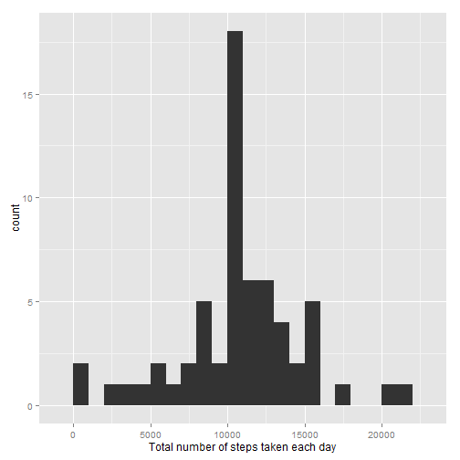

## Loading and preprocessing the data

```r
unzip(zipfile="repdata-data-activity.zip")
data <- read.csv("activity.csv")
```

## What is mean total number of steps taken per day?

A histogram of the total number of steps taken each day and the mean and median of the total number of steps taken per day.


```r
library(ggplot2)
total.steps <- tapply(data$steps, data$date, FUN=sum, na.rm=TRUE)
qplot(total.steps, binwidth=1000, xlab="Total number of steps taken each day")
```

 

```r
median(total.steps, na.rm=TRUE)
```

```
## [1] 10395
```

```r
mean(total.steps, na.rm=TRUE)
```

```
## [1] 9354
```

## What is the average daily activity pattern?

A time series plot of the 5-minute interval (x-axis) and the average number of steps taken from averaged across all days (y-axis)


```r
library(ggplot2)
averages <- aggregate(x=list(steps=data$steps), by=list(interval=data$interval),
                      FUN=mean, na.rm=TRUE)
ggplot(data=averages, aes(x=interval, y=steps)) +
    geom_line() +
    xlab("5-minute interval") +
    ylab("Average number of steps taken")
```

 

The 5-minute interval contains the maximum number of steps is


```r
averages[which.max(averages$steps),]
```

```
##     interval steps
## 104      835 206.2
```

## Imputing missing values

Total number of missing values`NA` in the dataset


```r
missing <- is.na(data$steps)
table(missing)
```

```
## missing
## FALSE  TRUE 
## 15264  2304
```

All of the missing values are filled in with mean value for that 5-minute
interval.


```r
# Replace each missing value with the mean value of its 5-minute interval

fill.value <- function(steps, interval) {
    filled <- NA
    if (!is.na(steps))
        filled <- c(steps)
    else
        filled <- (averages[averages$interval==interval, "steps"])
    return(filled)
}
filled.data <- data
filled.data$steps <- mapply(fill.value, filled.data$steps, filled.data$interval)
```
A histogram of the total number of steps taken each day and calculate the mean and median total number of steps.


```r
total.steps <- tapply(filled.data$steps, filled.data$date, FUN=sum)
qplot(total.steps, binwidth=1000, xlab="Total number of steps taken each day")
```

 

```r
mean(total.steps)
```

```
## [1] 10766
```

```r
median(total.steps)
```

```
## [1] 10766
```

Mean and median values are higher after imputing missing data. The reason is
that in the original data, there are some days with `steps` values `NA` which equals to 0, thus bringing down the mean and median values. After replacing missing `steps` values the 0 is remove which have impact of the mean and median.

## Are there differences in activity patterns between weekdays and weekends?

Find the day of the week for each measurement in the dataset. In
this part, we use the dataset with the filled-in values.


```r
filled.data$day <- weekdays(as.Date(filled.data$date))
filled.data$day_type <- ifelse(filled.data$day == "Saturday" 
                               | filled.data$day == "Sunday", "Weekend", "Weekday")
```

Panel plot containing plots of average number of steps taken across all weekday days or weekend days (y-axis).


```r
mean.steps <- aggregate(filled.data$steps, by = list(filled.data$interval, 
                                                     filled.data$day_type), mean)
names(mean.steps ) <- c("interval", "day_type", "steps")

xyplot(steps ~ interval | day_type, mean.steps, type = "l", layout = c(1, 2), 
       xlab = "Interval", ylab = "Number of steps")
```

 
